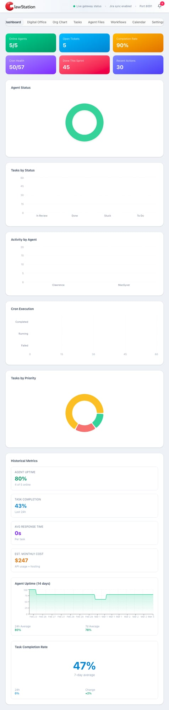
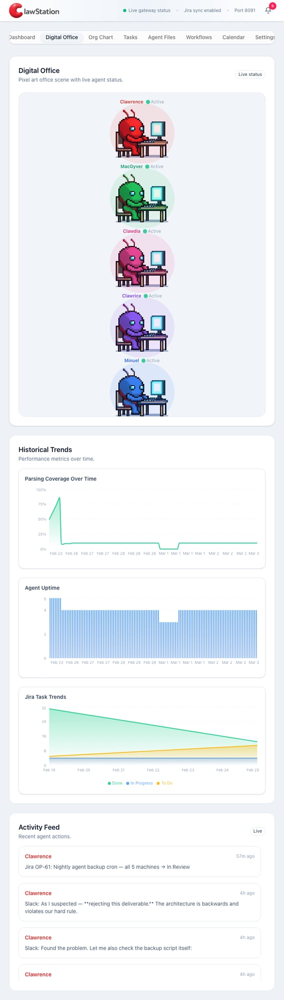
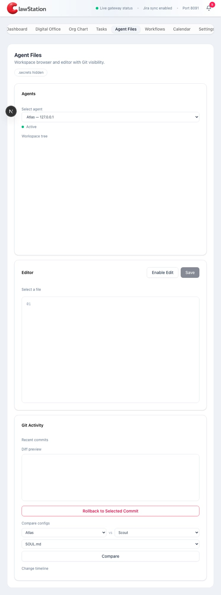

# 🦞 ClawStation — AI Agent Command Center

**Mission control for your AI agent fleet.**

Monitor health, track tasks, visualize workflows, and orchestrate your entire agent network from one beautiful dashboard.

[](https://clawstation.dev)

---

## Why ClawStation?

Running AI agents is powerful — but managing them is chaos. Scattered terminals, silent failures, no visibility into what's actually happening. ClawStation fixes that.

**One dashboard. Every agent. Full control.**

---

## Features

### 📊 Live Dashboard
Real-time agent status, task metrics, cron health, and activity charts. Know exactly what every agent is doing — right now.

### 🏢 Digital Office
Pixel art visualization of your agents with live status indicators. Watch them work, sleep, or error out in real time.

### 📋 Task Board
Jira-synced Kanban board with real-time ticket updates. Assign work, track progress, close tickets — all from one view.

### 📁 Agent Files
SSH-powered file browser with built-in editor, git history, and diff viewer. Read and edit agent files without leaving the dashboard.

### ⚡ n8n Workflows
Visual workflow automation with cron job monitoring. See your automations running and catch failures before they cascade.

### 🗓️ Calendar
Unified view of schedules, deadlines, and events across your entire agent fleet.

### 📱 Mobile Responsive
Full mobile support. Check on your agents from anywhere.

---

## Architectures

| Setup | Description | Best For |
|-------|-------------|----------|
| **Single Machine** | All agents as sub-agents on one machine | Getting started, small teams |
| **Multi-Machine** | Agents on separate machines via SSH | Power users, production fleets |

---

## Pricing

| Plan | Price | What You Get |
|------|-------|--------------|
| **Monthly** | $29/mo | Full access, managed updates, priority support |
| **Lifetime** | $299 one-time | Self-hosted, run forever on your own infrastructure |

Both plans include all features. No feature gating. No per-agent fees.

### 👉 [Get ClawStation](https://clawstation.dev/buy)

---

## What's Included

- Full Next.js dashboard application
- Interactive setup wizard (no config files to edit manually)
- Docker support (one-command deploy)
- PM2 production config
- Cloudflare Tunnel setup guide
- Jira Cloud integration
- n8n workflow engine integration
- Ongoing updates and bug fixes

---

## Requirements

- Node.js 20+
- OpenClaw installed on your agent machine(s)
- Jira Cloud account (optional)
- n8n instance (optional)

---

## Quick Start (after purchase)

```bash
git clone <your-private-repo-link>
cd clawstation
npm install
cp config.example.json config.json
npm run build && npm start
```

Open `http://localhost:3000` — the setup wizard walks you through everything.

---

## Screenshots

| Dashboard | Digital Office | Task Board |
|-----------|---------------|------------|
|  |  |  |

| Agent Files | Workflows | Calendar |
|-------------|-----------|----------|
|  |  |  |

---

## FAQ

**Do I need OpenClaw to use ClawStation?**
Yes. ClawStation is built to manage OpenClaw agents. It reads agent configs, SSH connections, and Jira boards from your OpenClaw setup.

**Can I try it before buying?**
Check out our [live demo](https://demo.clawstation.dev) to see the dashboard in action.

**What if I need help setting up?**
Every purchase includes setup support. Email us or join our Discord and we'll help you get running.

**Do you offer refunds?**
Yes — 14-day money-back guarantee, no questions asked.

---

## Support

- 🌐 Website: [clawstation.dev](https://clawstation.dev)
- 📧 Email: hello@clawstation.dev
- 💬 Discord: [Join the community](https://discord.gg/clawstation)
- 📚 Docs: [docs.clawstation.dev](https://docs.clawstation.dev)

---

## Built With

Next.js • Tailwind CSS • Recharts • Lucide Icons • shadcn/ui

---

*Built by the team behind OpenClaw. We run our own 5-agent fleet on ClawStation daily.*
